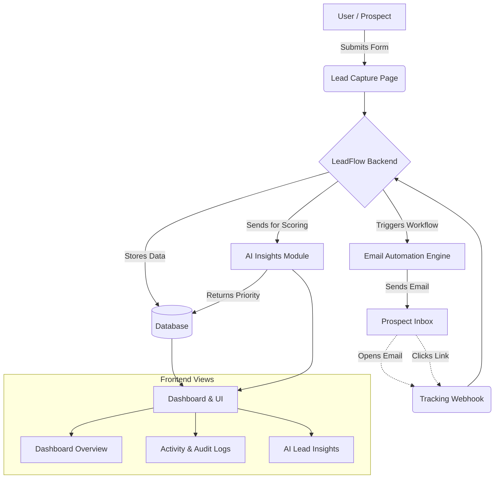

# Automated Lead Management & Email Tracking System (LeadFlow AI)

 **[View Live Demo](https://keshavmishra27.github.io/Automated-Lead-Management-Email-Tracking-System/)**

LeadFlow AI is a comprehensive, modern web application designed for end-to-end lead management, automated email sequencing, and intelligent tracking. It features AI-powered insights for lead prioritization, robust engagement tracking, and a developer-friendly observability dashboard.

##  Key Features

| Feature | Description |
| :--- | :--- |
| **Lead Capture** | Seamlessly capture new leads via customizable forms. |
| **AI Insights** | Automatically score and prioritize leads (e.g., High, Medium, Low) based on engagement data using AI models. |
| **Email Automation** | Trigger personalized email sequences automatically upon lead capture or specific milestones. |
| **Engagement Tracking** | Monitor real-time email opens, link clicks, and other critical interactions. |
| **Analytics Dashboard** | Datadog/Grafana inspired dashboard offering deep observability into system events, funnel metrics, and acquisition trends. |

##  System Architecture & Flowchart

The following flowchart illustrates the high-level data flow from initial lead capture to dashboard analytics.



##  Tech Stack

| Layer | Technologies Used |
| :--- | :--- |
| **Frontend Framework** | React, TypeScript, Vite |
| **Styling & Animation** | Tailwind CSS, Lucide React, Framer Motion |
| **Data Visualization** | Plotly.js |
| **Backend API** | FastAPI, Python, Uvicorn |
| **Email Integration** | Native SMTP library |

##  API Endpoints

| Endpoint | Method | Description |
| :--- | :---: | :--- |
| `/api/leads` | `GET` | Retrieve a list of all leads with their AI scores |
| `/api/leads` | `POST` | Submit a new lead into the system |
| `/api/mail/send` | `POST` | Send an email to a lead via SMTP |
| `/api/mail/track` | `GET` | Webhook endpoint for tracking email opens |
| `/api/mail/click` | `GET` | Webhook endpoint for tracking email link clicks |

##  Getting Started

Follow these instructions to get a copy of the project up and running on your local machine for development and testing purposes.

### Prerequisites

- Node.js (v18 or higher recommended)
- npm or yarn

### Installation

1. **Clone the repository:**
   ```bash
   git clone https://github.com/keshavmishra27/Automated-Lead-Management-Email-Tracking-System.git
   ```

2. **Navigate to the frontend directory:**
   ```bash
   cd Automated-Lead-Management-Email-Tracking-System/frontend
   ```

3. **Install dependencies:**
   ```bash
   npm install
   ```

4. **Start the development server:**
   ```bash
   npm run dev
   ```

5. **Start the backend server:**
   Open a new terminal, navigate to the `backend` directory, and run:
   ```bash
   cd ../backend
   pip install fastapi uvicorn pydantic
   uvicorn main:app --reload
   ```

6. Open your browser and navigate to the local URL provided by Vite (usually `http://localhost:5173`).

##  Observability & Monitoring

The system includes a dedicated **Activity Logs** page designed for high-density observability. It tracks:
- *System Events:* Errors, retries, integration syncs.
- *Lead Events:* Form submissions, AI classifications.
- *Email Events:* Sent, Opened, Clicked.

All events are filterable by time, actor, and status, providing unparalleled visibility into your sales funnel operations.